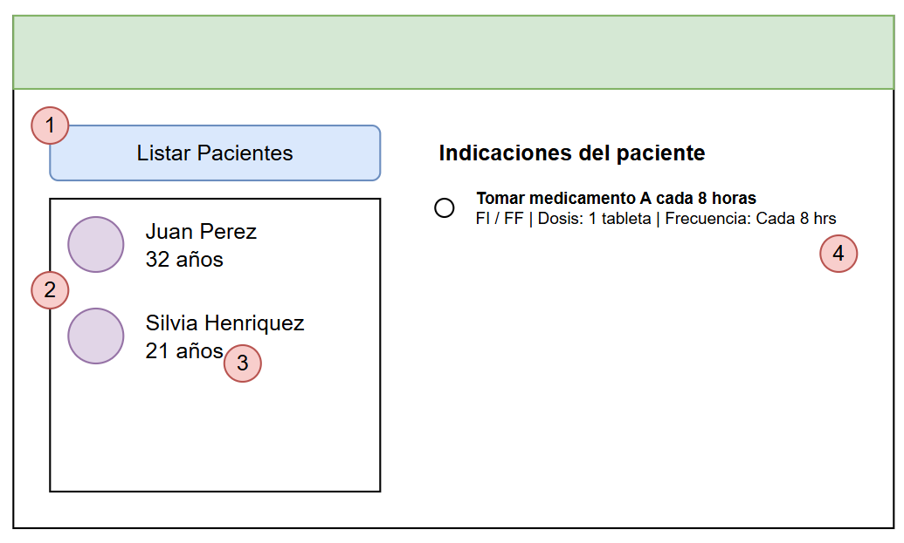
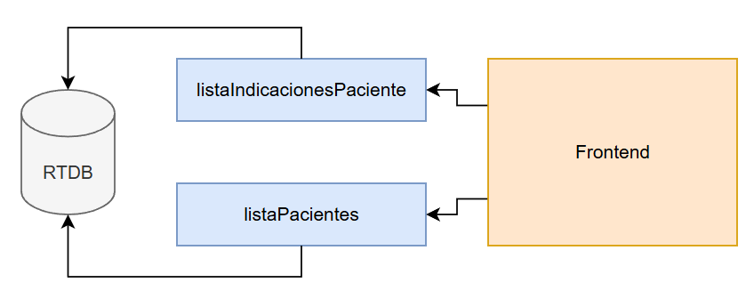
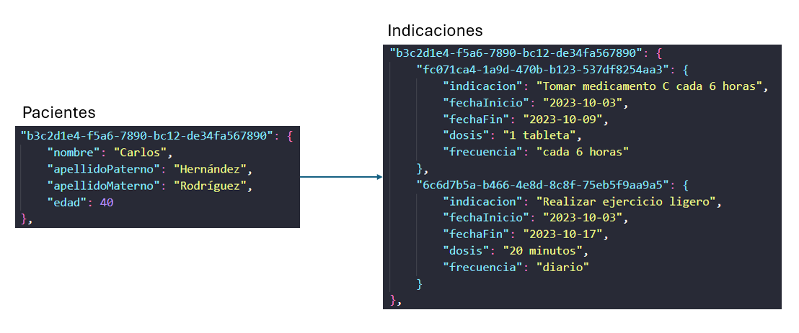

# HICAPPS Technical Test

La presente prueba técnica pretende evaluar sus habilidades y competencias para el cargo de **Desarrollador Full Stack**.
El test consta del desarrollo de un micro-proyecto los cuales debe resolver en un periodo máximo de 48hrs. desde que ha sido presentado este repositorio vía email.

# Descripción
Se busca que el candidato construya una aplicación web utilizando Realtime Database (RTDB) y Cloud Firebase Functions de Firebase y un Frontend sencillo con Vue3JS. Esta aplicación web permitirá listar pacientes y al hacer click sobre un paciente, traera una lista de indicaciones médicas según muestra el siguiente esquema:

1. La aplicacion web parte con un boton, una lista vacía de pacientes y una lista vacía de indicaciones del paciente.
2. El usuario al hacer click debe hacer una llamada a una Cloud Function para poder traer la lista de pacientes desde RTDB. La lista de pacientes se popula según el diagrama adjunto
3. Al hacer click sobre un paciente, se debe realizar otra llamada a una Cloud Function para así poder traer la lista de indicaciones asociadas a un paciente.
4. En la lista de indicaciones asociadas al paciente se debe listar la indicacion, la fecha de inicio (FI) y fecha fin (FF), dosis y frecuencia.

# Diagrama arquitectura esperado

Se espera que el candidato pueda construir esta solución utilizando integramente emuladores locales de Firebase. Se adjuntan los datos de pacientes (`pacientes.json`) e indicaciones asociadas al paciente (`indicaciones.json`).

### Requisitos previos
* Instalar en su máquina local Firebase CLI: `npm install -g firebase-tools`
* Utilizar los sets de datos de prueba presente en la carpeta `datos` para popular información en

### Requerimientos 
* Crear una aplicación frontend que pueda comunicarse con las 2 Cloud Firebase Functions. El candidato debe construir estas funciones y se espera que se utilice el mismo SDK de Firebase para poder llamar a estas funciones.
* La firebase function que permita listar los pacientes debe llamarse `listaPacientes`. Esta función debe leer desde un nodo de RTDB llamado `pacientes` el contenido presente en el archivo `pacientes.json` (se debe cargar esta info a RTDB).
* La firebase function que permita listar los pacientes debe llamarse `listaIndicacionesPaciente`. Esta función debe leer desde un nodo de RTDB llamado `indicaciones` el contenido presente en el archivo `indicaciones.json` (se debe cargar esta info a RTDB). Se deben solo leer las indicaciones asociadas a un UUID de un paciente. Se adjunta una imagen de ejemplo

* Al hacer click sobre el boton **Listar Pacientes**, se debe realizar la llamada a `listaPacientes`. El resultado de la llamada se debe guardar en un store de [Pinia](https://pinia.vuejs.org/), donde posteriormente se listará la información. La lista debe popular sus registros desde el store, no desde la llamada de red.  
Cada vez que se haga nuevamente click en el botón **Listar Pacientes**, se debe borrar el store y cargar nuevamente toda la informacion
* Al hacer click sobre un paciente, se debe realizar la llamada a `listaIndicacionesPaciente`, donde se debe entregar el UUID asociado al paciente para asi poder traer su lista de inficaciones. [Pinia](https://pinia.vuejs.org/), donde posteriormente se listará la información en la sección "Indicaciones del paciente"
* Si se hace click en otro paciente, se debe eliminar la lista de indicaciones del paciente y mostrar las indicaciones del nuevo paciente seleccionado (siempre leyendo desde el store y populando el contenido del store con la llamada hacia Cloud Firebase Function)

### Requerimientos no funcionales
* Se debe utilizar el SDK oficial para Firebase en este proyecto
* El projecto debe utilizar JavaScript (no TypeScript)
* Se deben utilizar exclusivamente emuladores locales (oficiales) del ecosistema de Firebase.
* Se deben entregar todas las instrucciones para poder levantar el emulador en forma local y provisionar los datos necesarios para que la aplicación functione

# Entregables
El candidato debe realizar entrega de lo siguiente:
* URL con el repositorio al código de la solución (público).

# Criterios de evaluación
La evaluación del proyecto será cualitativa, basado en aspectos como legibilidad, modularización y consistencia en estilo de programación (indentación, nombre semántico de variables, etc).

> Importante: Es posible utilizar herramientas de IA que apoyen la construcción de esta solución. Sin embargo, haremos incapié en detalles del código al momento de revisar la solución entregada.

# Ayudas
* Para inicializar un proyecto nuevo de Firebase: `firebase init`
* Para loguearse a Firebase mediante la CLI: `firebase login`
* Para deployear una Cloud Function: `firebase deploy --only=functions`

# Referencias
* [Firebase CLI](https://firebase.google.com/docs/cli)
* [Firebase Real Time Database (RTDB)](https://firebase.google.com/docs/database?hl=es)
* [Firebase Cloud Functions](https://firebase.google.com/docs/functions)